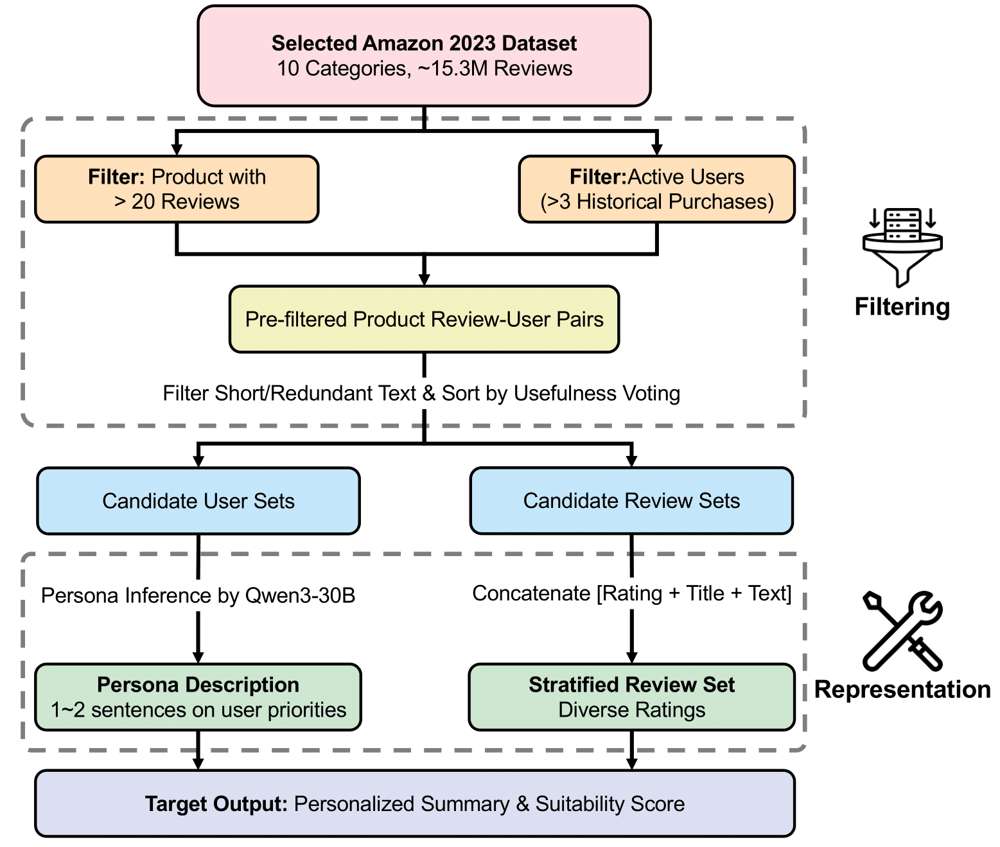
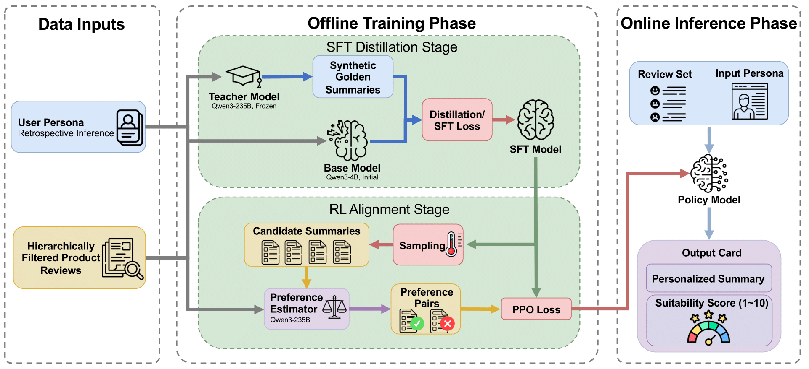
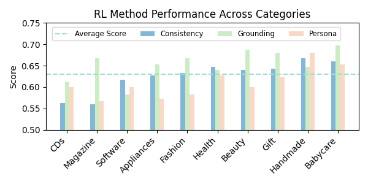

# SumForU


## Overview

SumForU is an end-to-end project designed to generate persona-aware product summaries from customer reviews. Utilizing the Tinker platform[Tinker](https://tinker-docs.thinkingmachines.ai/) for advanced model training and inference, it integrates supervised fine-tuning (SFT) and reinforcement learning from AI feedback (RLAIF) to produce customized product briefings and suitability ratings tailored to individual shopper profiles. The project provides a full suite of tools for data preprocessing, synthesis, model evaluation, and experiment management, enabling researchers to build and assess personalized summarization systems efficiently.


## Method

### data construction pipeline


### method overview


## Results

### Comparison Analysis
**Rule-based Judge**
|  | Summary Text | | | | | Suitability Score | | |
|:--------:|:-------------:|:-------------:|:-------------:|:-------------:|:-------------:|:------------------:|:-------------:|:-------------:|
| Method | RevCov | PersCov | RefBS-R | RevBS-P | PersBS-R | MAE | Spearman | Within1Acc |
| baseline | 0.3571 | 0.2683 | 0.7135 | 0.7618 | 0.8257 | 1.2362 | 0.4233 | 0.7007 |
| pe | 0.3611 | 0.2148 | 0.7146 | 0.7606 | 0.8172 | 1.2515 | 0.4498 | 0.6890 |
| sft | 0.3029 | 0.1954 | 0.7185 | 0.7542 | 0.8238 | 1.1130 | 0.5583 | 0.7720 |
| rl | 0.2816 | 0.1944 | 0.7220 | 0.7516 | 0.8345 | 1.0780 | 0.5629 | 0.7640 |

**LLM-based Judge**
- Judge: Qwen/Qwen3-235B-A22B-Instruct-2507

| Method | Overall | Consistency | Grounding | Persona |
|--------|---------|-------------|-----------|---------|
| BASELINE | 0.336 | 0.441 | 0.331 | 0.235 |
| PE | 0.489 | 0.435 | 0.709 | 0.322 |
| SFT | 0.507 | 0.440 | 0.531 | 0.551 |
| RL | 0.668 | 0.684 | 0.429 | 0.892 |

- Judge: openai/gpt-oss-120b

| Method | Overall | Consistency | Grounding | Persona |
|--------|---------|-------------|-----------|---------|
| BASELINE | 0.441 | 0.464 | 0.361 | 0.497 |
| PE | 0.439 | 0.419 | 0.466 | 0.431 |
| SFT | 0.490 | 0.488 | 0.532 | 0.452 |
| RL | 0.630 | 0.629 | 0.642 | 0.620 |

### Category Analysis


### Generalization Analysis
**Video_Games**

| Method | MAE | Spearman | Within1Acc | Consistency | Grounding | Persona |
|--------|-----|----------|------------|-------------|-----------|---------|
| baseline | 1.1300 | 0.5199 | 0.7200 | 0.443 | 0.360 | 0.440 |
| rl | 1.0500 | 0.5522 | 0.7800 | 0.630 | 0.630 | 0.637 |

**Arts_Crafts_and_Sewing**

| Method | MAE | Spearman | Within1Acc | Consistency | Grounding | Persona |
|--------|-----|----------|------------|-------------|-----------|---------|
| baseline | 1.3550 | 0.3184 | 0.6400 | 0.480 | 0.390 | 0.457 |
| rl | 1.1600 | 0.5335 | 0.7500 | 0.640 | 0.587 | 0.617 |

**Industrial_and_Scientific**

| Method | MAE | Spearman | Within1Acc | Consistency | Grounding | Persona |
|--------|-----|----------|------------|-------------|-----------|---------|
| baseline | 1.3100 | 0.4882 | 0.6900 | 0.500 | 0.310 | 0.463 |
| rl | 1.0600 | 0.5418 | 0.7700 | 0.623 | 0.683 | 0.607 |

## Repository Layout

```
SumForU/
|
|-- dataset/
|   |-- __init__.py                 # Path helpers for data directories
|   |-- preprocess.py               # Data preprocessing scripts
|   |-- synthesize_data.py          # Generate SFT and RL training data
|   |-- generate_persona.py         # Create customer personas from reviews
|   `-- data/
|       |-- raw/                    # Raw review data and inputs
|       `-- processed/
|           |-- sft/                # Processed data for supervised fine-tuning
|           `-- rl/                 # Processed data for reinforcement learning
|
|-- scripts/
|   |-- test/
|   |   |-- config.py               # Model configurations and **PROMPTS**
|   |   |-- test.py                 # Inference and testing scripts
|   |   `-- utils.py                # Utility functions for testing
|   |-- train/
|   |   |-- prometheus_types.py     # Data types for reward modeling
|   |   |-- rl_env.py               # RL environment setup
|   |   |-- rl.py                   # RL training script
|   |   `-- sft.py                  # SFT training script
|   `-- eval/
|       |-- llm_judge.py            # LLM-based evaluation
|       `-- rule_judge.py           # Rule-based evaluation
|
|-- assets/                         # Static assets and resources
|-- .env.example                    # Example environment variables
|-- requirements.txt                # Python dependencies
`-- README.md                       # Project documentation
```


## Quickstart

### 1. Clone & Environment

```bash
git clone git@github.com:Harry20030331/SumForU.git
cd SumForU

# Recommended: create a dedicated virtual environment
conda create -n sumforu python=3.11
conda activate sumforu
```

Install the required Python packages:

```bash
pip install tinker
pip install git+https://github.com/thinking-machines-lab/tinker-cookbook.git
pip install datasets wandb python-dotenv tqdm rich chz numpy torch
```

Install all dependencies from requirements.txt:

```bash
pip install -r requirements.txt
```

Set up environment variables:

> **Tinker credentials** – copy `.env.example` to `.env` and add your Tinker API key (and any other secrets your workspace requires). All scripts that talk to Tinker load credentials via `python-dotenv`.


### 2. Data Preprocessing & Synthesis

**generate persona**
Batch preprocess stringified review data to generate personas.

```bash
python dataset/generate_persona.py --input-dir dataset/data/raw --output-dir dataset/data/preprocessed
```

Options:
- `--input-dir`: Directory containing stringified JSON files (default: dataset/data/raw)
- `--output-dir`: Directory to save preprocessed JSON files (default: dataset/data/preprocessed)

**synthesize data**
Generate SFT and RL datasets from preprocessed data.

```bash
python -m dataset.synthesize_data --mode both --input-dir dataset/data/preprocessed --output-dir dataset/data/processed
```

Options:
- `--mode`: Select which dataset to generate: sft, rl, or both (default: both)
- `--input-dir`: Directory containing preprocessed JSON files (default: dataset/data/preprocessed)
- `--output-dir`: Directory to save processed datasets (default: dataset/data/processed)
- `--rubric`: Rubric string for RL prompts (default: predefined)
- `--model-name`: Model name for SFT data generation (default: Qwen/Qwen3-235B-A22B-Instruct-2507)
- `--concurrency`: Number of concurrent requests for SFT (default: 5000)
- `--seed`: Random seed (default: 42)

### 3. Model Training
Train supervised fine-tuning and reinforcement learning models.

**SFT training**
Train a supervised fine-tuning model.

```bash
python scripts/train/sft.py --category whole_dataset \
   --log-path results/logs/sft_personalized_model_v5 \
   --wandb-name sft_personalized_model_v5   \
   --num-epochs 10
```

Options:
- `--model-name`: Model to fine-tune (default: Qwen/Qwen3-4B-Instruct-2507)
- `--category`: Category to train on: one of the 10 categories or 'whole_dataset' (default: whole_dataset)
- `--log-path`: Directory for checkpoints and logs (default: results/logs/sft_personalized_model)
- `--learning-rate`: Learning rate (default: 0.0002)
- `--num-epochs`: Number of epochs (default: 50)
- `--eval-every`: Evaluate every N steps (default: 8)
- `--max-length`: Maximum token length (default: 4096)
- `--batch-size`: Batch size (default: 16)
- `--lr-schedule`: Learning rate schedule (default: linear)
- `--wandb-name`: Wandb run name (default: sft_4b_v1)

**RL training**
Train a reinforcement learning model.

```bash
python scripts/train/rl.py category=whole_dataset    \
   log_path=results/logs/rl_personalized_model_sftinit_v6 \
   wandb_name=rl_personalized_model_sftinit_v6 \
   learning_rate=1e-5 \
   train_repeat=1 \
   eval_every=10 \
   model_path=tinker://7a1e1cf8-20ba-5aff-94b1-bb59b61967cc:train:0/weights/final
```

Options:
- `--model-name`: Policy model name (default: Qwen/Qwen3-4B-Instruct-2507)
- `--model-path`: Path to pre-trained model checkpoint (optional)
- `--reward-model-name`: Reward model name (default: Qwen/Qwen3-235B-A22B-Instruct-2507)
- `--reward-model-path`: Path to reward model (optional)
- `--category`: Category to train on: one of the 10 categories or 'whole_dataset' (default: whole_dataset)
- `--log-path`: Directory for logs (default: results/logs/rl_4b_v3)
- `--max-length`: Maximum token length (default: 8192)
- `--learning-rate`: Learning rate (default: 0.00004)
- `--batch-size`: Batch size (default: 16)
- `--group-size`: Group size for RL (default: 4)
- `--eval-every`: Evaluate every N steps (default: 5)
- `--train-repeat`: Repeat training data factor (default: 5)
- `--wandb-project`: Wandb project (default: SumForU)
- `--wandb-name`: Wandb run name (default: rl_4b_v3)

### 4. Model Evaluation
Run evaluation on a specified model type for whole dataset.

**generate model test outputs**
```bash
python -m scripts.test.test --model_type all \
   --category whole_dataset \
   --output results/whole_dataset/
```

**use rule-based judge**
run rules-based and quantitative evaluation on multiple model outputs.

```bash
python -m scripts.eval.rule_judge \
  --gt-path dataset/data/processed/sft/test \
  --baseline-path results/whole_dataset/baseline.json \
  --pe-path results/whole_dataset/pe.json \
  --sft-path results/whole_dataset/sft.json \
  --rl-path results/whole_dataset/rl.json
```

Options:
- `--gt-path`: Path to ground truth data (required): either a JSON file or a directory containing .jsonl files to merge
- `--baseline-path`: Path to baseline model outputs JSON (optional)
- `--sft-path`: Path to SFT model outputs JSON (optional)
- `--pe-path`: Path to PE model outputs JSON (optional)
- `--rl-path`: Path to RL model outputs JSON (optional)

**use llm-based judge**
run LLM-based pairwise judgment evaluation on multiple model outputs.

```bash
python scripts/eval/llm_judge.py \
  --test-data-path dataset/data/processed/sft/test \
  --baseline-path results/whole_dataset/baseline.json \
  --sft-path results/whole_dataset/sft.json \
  --pe-path results/whole_dataset/pe.json \
  --rl-path results/whole_dataset/rl.json
```

Options:
- `--test-data-path`: Path to test data (required): either a JSON file or a directory containing .jsonl files to merge
- `--baseline-path`: Path to baseline model outputs JSON (optional)
- `--sft-path`: Path to SFT model outputs JSON (optional)
- `--pe-path`: Path to PE model outputs JSON (optional)
- `--rl-path`: Path to RL model outputs JSON (optional)

## Acknowledgements
- The [Tinker Cookbook](https://tinker-docs.thinkingmachines.ai/) for providing the training primitives used throughout the project.
- The [SALT-NLP/cs329x_hw2](https://github.com/SALT-NLP/cs329x_hw2) team for open-sourcing prompts and evaluation patterns that informed our baseline experiments.
- Everyone who contributed anonymized review data powering SumForU’s personas.